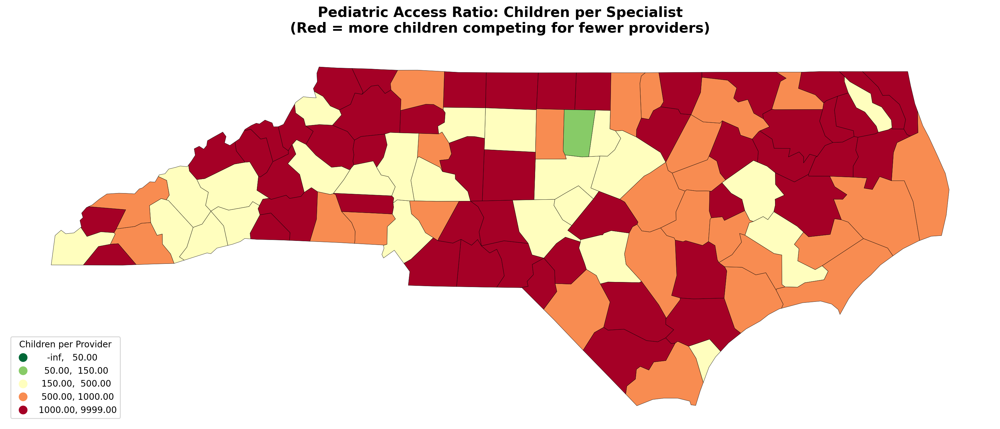
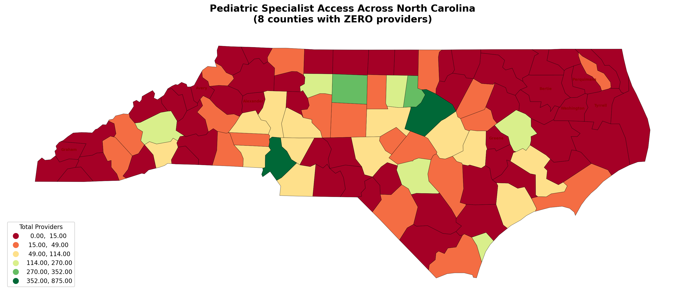
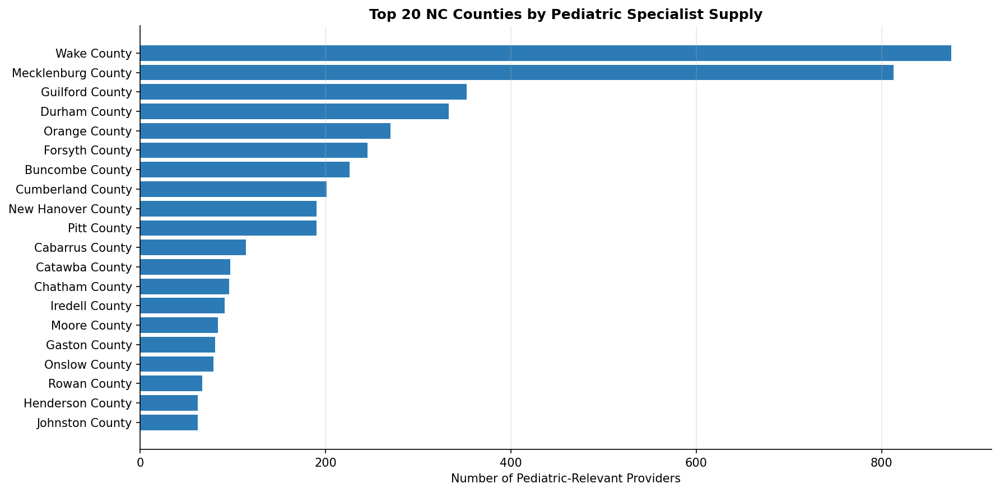
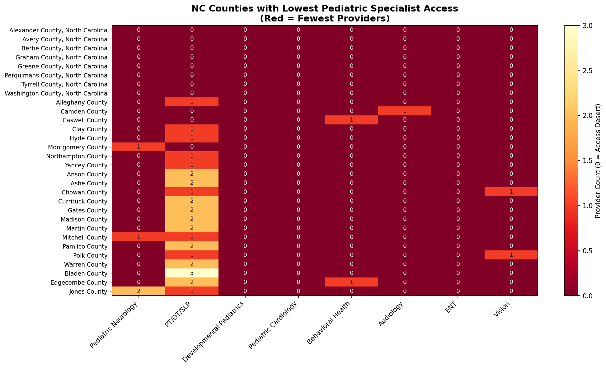
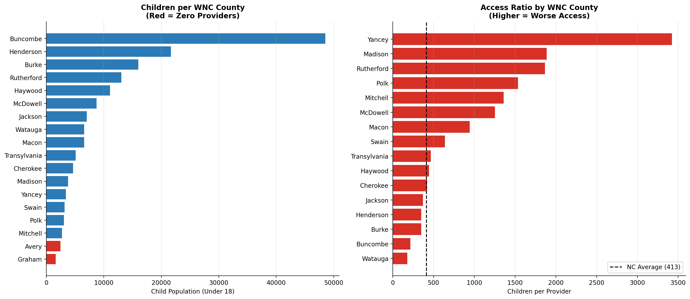
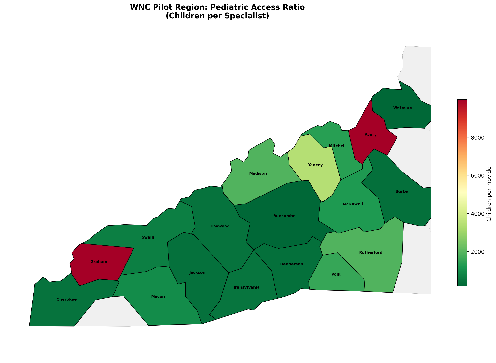

# NC Pediatric Access Desert Analysis

## Mapping the Gap Between Referral and Care

A Python data pipeline mapping pediatric specialist supply against child population demand across North Carolina's 100 counties to quantify access deserts and support the design of pilot access infrastructure in Western NC.

---

## Executive Summary

This project identifies pediatric specialist access deserts across North Carolina by integrating federal provider registries with census population data. Results show **67% of counties face severe shortages** and **8 counties have zero specialists**. Findings support targeted infrastructure planning for rural healthcare access programs.

---

## Key Result Visualization



*Counties classified by children-per-provider ratio. Darker regions indicate more severe access deserts.*

---

## The Problem

Children with complex medical needs are routinely referred to pediatric specialists. But a referral is not care. Between the moment a referral is placed and the moment a child is actually seen, there is a gap that no system owns. Wait times stretch months. Cancellations go unfilled. Families shoulder the coordination burden alone. Developmental windows close in silence.

This analysis quantifies that gap for North Carolina.

---

## Why This Matters

Delayed access to pediatric specialty care can permanently alter a child’s developmental trajectory. When children cannot see needed specialists in time, treatable conditions may worsen, developmental windows may close, and families are left navigating complex medical systems alone.

By identifying where access gaps exist, this analysis provides decision-makers with actionable evidence to guide resource allocation, infrastructure planning, and targeted interventions that can improve health outcomes for vulnerable populations.

---

## Core Insight

**Geographic provider presence does not equal functional access.**
Counties with zero or near-zero specialists experience systemic delays that push care outside clinically meaningful treatment windows.

---

## Key Findings

### Statewide Pediatric Access Crisis

* **2.28 million children** in North Carolina
* **67 of 100 counties** classified as Severe Access Deserts (>500 children per provider)
* **8 counties** have zero pediatric specialists of any kind — **23,435 children** with no local access
* Only **1 county** qualifies as “Adequate.” None are “Well-Served.”

---

### Specialty Deserts Are Pervasive

| Specialty                | Counties with Zero Providers |
| ------------------------ | :--------------------------: |
| Pediatric Cardiology     |           85 / 100           |
| Behavioral Health        |           57 / 100           |
| Developmental Pediatrics |           50 / 100           |
| ENT                      |           49 / 100           |
| Audiology                |           47 / 100           |
| Pediatric Neurology      |           43 / 100           |
| Vision                   |           42 / 100           |
| PT/OT/SLP                |           11 / 100           |

---

### Western NC Regional Disparity

* Buncombe County holds **48% of all WNC pediatric specialists** — 226 of 470 providers across 18 counties
* **17 of 18 WNC counties** have zero pediatric cardiologists
* **14 of 18** have zero developmental pediatricians
* Yancey County: **3,423 children, 1 provider** (ratio 3,423:1)
* Graham and Avery counties: **zero providers of any kind**

---

## Statewide Visualizations

### Provider Supply by County



### Pediatric Neurology Access


### Children-Per-Provider Ratio


### Top 20 Counties by Providers



### Lowest Access Counties



---

## Western North Carolina Deep Dive

### Specialty Availability


### Population vs Access Ratio



### Regional Access Map



---

## Technical Highlights

* Automated API ingestion pipeline for federal datasets
* Spatial joins across multiple geographic resolutions
* Provider deduplication across taxonomy codes
* County-level aggregation and classification modeling
* Fully reproducible geospatial analytics workflow

---

## Data Sources

| Source                       | Description                                   |
| ---------------------------- | --------------------------------------------- |
| CMS NPI Registry             | Provider locations by specialty taxonomy code |
| Census ACS 5-Year            | Child population and poverty rates            |
| Census TIGER/Line            | County boundary shapefiles                    |
| Census ZCTA-County Crosswalk | ZIP-to-county mapping                         |

---

### Specialties Tracked

Pediatric Neurology · PT/OT/SLP · Developmental Pediatrics · Pediatric Cardiology · Behavioral Health · Audiology · ENT · Ophthalmology/Vision

---

## Methodology

### Supply Side

1. Query NPPES API across pediatric taxonomy codes
2. Parse addresses and deduplicate providers
3. Map ZIP → county FIPS
4. Aggregate providers by county and specialty

### Demand Side

1. Pull child population + poverty rates from Census
2. Join to county FIPS

### Access Analysis

1. Merge supply + demand datasets
2. Calculate children-per-provider ratios
3. Classify counties:

   * Well-Served (≤50)
   * Adequate (51–150)
   * Underserved (151–500)
   * Severe Desert (>500)
   * No Providers (0)
4. Generate maps and visualizations

### WNC Deep Dive

Focused analysis of 18 pilot counties comparing specialty availability and access ratios against statewide benchmarks.

---

## Repository Structure

```
nc-pediatric-access-pipeline/
├── notebooks/
├── data/
├── figures/
├── maps/
└── README.md
```

---

## Tech Stack

Python · pandas · geopandas · folium · matplotlib · numpy · requests

---

## Portfolio Impact Summary

* Integrated **7,279 provider records** across 13 specialty taxonomies
* Built reproducible geospatial ETL pipeline from federal APIs
* Classified access levels across all 100 counties
* Produced decision-ready maps for policy and infrastructure planning

---

## How to Reproduce

```bash
git clone https://github.com/JohnApelJr/nc-pediatric-access-pipeline.git
cd nc-pediatric-access-pipeline
pip install pandas numpy geopandas folium mapclassify matplotlib requests
jupyter notebook notebooks/analysis.ipynb
```

---

## Context

This analysis was developed to support research into pediatric access infrastructure — systems designed to reduce delays between identified care needs and actual outpatient care initiation. Western North Carolina was selected as a pilot region due to its combination of urban provider concentration and geographically isolated rural populations.

---

## Future Extensions

* Travel-time accessibility modeling
* Wait-time prediction modeling
* Mobile specialty clinic simulation
* Telehealth hub optimization analysis

---

## Author

**John Apel**
M.S. Applied Data Science — Syracuse University

[Portfolio](https://johnapeljr.github.io) · [LinkedIn](https://linkedin.com/in/john-apel-76700154) · [GitHub](https://github.com/JohnApelJr)

