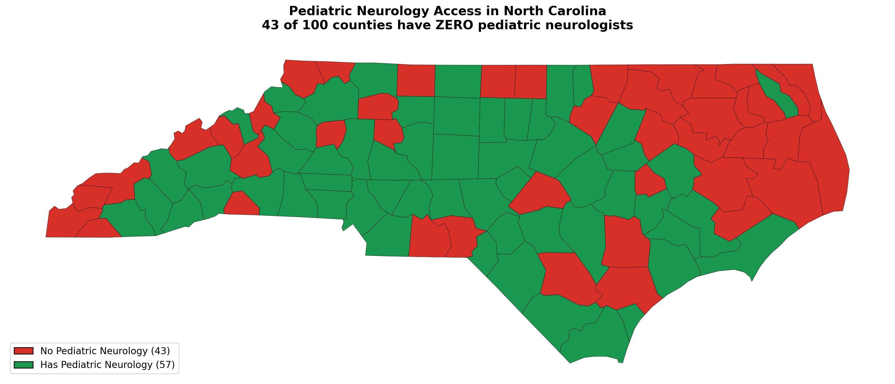
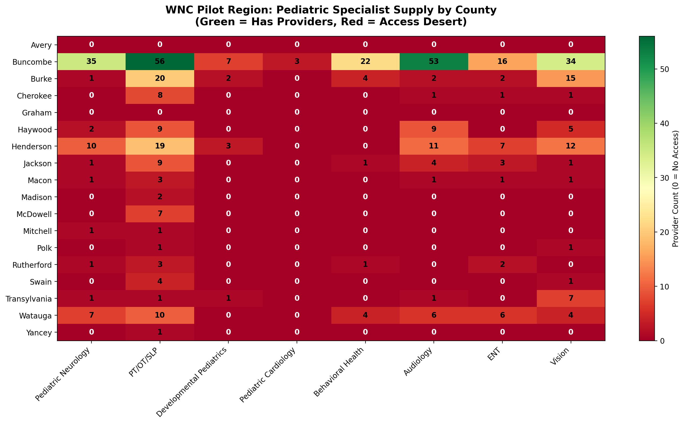

# NC Pediatric Access Desert Analysis
## Mapping the Gap Between Referral and Care

A Python data pipeline mapping pediatric specialist supply against child population demand across North Carolina's 100 counties to quantify access deserts and support the design of pilot access infrastructure in Western NC.

## Executive Summary
This project identifies pediatric specialist access deserts across North Carolina by integrating federal provider registries with census population data. Results show 67% of counties face severe shortages and 8 counties have zero specialists. Findings support targeted infrastructure planning for rural healthcare access programs.


*43 of 100 NC counties have zero pediatric neurologists.*

---

## The Problem

Children with complex medical needs are routinely referred to pediatric specialists. But a referral is not care. Between the moment a referral is placed and the moment a child is actually seen, there is a gap that no system owns. Wait times stretch months. Cancellations go unfilled. Families shoulder the coordination burden alone. Developmental windows close in silence.

This analysis quantifies that gap for North Carolina.

---

## Why This Matters


Delayed access to pediatric specialty care can permanently alter a child’s developmental trajectory. When children cannot see needed specialists in time, treatable conditions may worsen, developmental windows may close, and families are left navigating complex medical systems alone.

By identifying where access gaps exist, this analysis provides decision-makers with actionable evidence to guide resource allocation, infrastructure planning, and targeted interventions that can improve health outcomes for vulnerable populations.


---

## Key Findings

### The state has a systemic pediatric access crisis.
- **2.28 million children** in North Carolina
- **67 of 100 counties** classified as Severe Access Deserts (>500 children per provider)
- **8 counties** have zero pediatric specialists of any kind — 23,435 children with no local access
- Only **1 county** in the entire state qualifies as "Adequate." Zero are "Well-Served."

### Specialty deserts are pervasive.
| Specialty | Counties with Zero Providers |
|-----------|:---:|
| Pediatric Cardiology | 85 / 100 |
| Behavioral Health | 57 / 100 |
| Developmental Pediatrics | 50 / 100 |
| ENT | 49 / 100 |
| Audiology | 47 / 100 |
| Pediatric Neurology | 43 / 100 |
| Vision | 42 / 100 |
| PT/OT/SLP | 11 / 100 |

### Western NC illustrates extreme intra-regional disparity.
- Buncombe County (Asheville) holds **48% of all WNC pediatric specialists** — 226 of 470 providers across 18 counties
- **17 of 18 WNC counties** have zero pediatric cardiologists
- **14 of 18** have zero developmental pediatricians
- Yancey County: **3,423 children, 1 provider** (ratio 3,423:1)
- Graham and Avery counties: **zero providers of any kind**


*WNC pilot region: provider counts by county and specialty. Red = zero providers.*

---

## Technical Highlights
- Automated API ingestion pipeline for federal datasets
- Spatial joins across multiple geographic resolutions
- Provider deduplication across taxonomy codes
- County-level aggregation and classification modeling
- Fully reproducible geospatial analytics workflow
  
---

## Data Sources

| Source | Description | Access |
|--------|-------------|--------|
| [CMS NPI Registry](https://npiregistry.cms.hhs.gov/) | Provider locations by specialty taxonomy code | NPPES API (free, no key) |
| [Census ACS 5-Year (2022)](https://www.census.gov/programs-surveys/acs) | Child population, poverty rates by county | Census API (free) |
| [Census TIGER/Line](https://www.census.gov/geographies/mapping-files.html) | County boundary shapefiles | Direct download |
| [Census ZCTA-County Crosswalk](https://www.census.gov/geo/maps-data/) | ZIP code to county FIPS mapping | Direct download |

### Specialties Tracked
Mapped to Healthcare Provider Taxonomy Codes (NUCC) covering the referral types most common in pediatric care coordination:

Pediatric Neurology · PT/OT/SLP · Developmental Pediatrics · Pediatric Cardiology · Behavioral Health · Audiology · ENT/Otolaryngology · Ophthalmology/Vision

---

## Methodology

### Supply Side
1. Query NPPES API for NC providers across 13 pediatric-relevant taxonomy codes
2. Parse practice addresses, deduplicate by NPI + taxonomy
3. Map provider ZIP codes to counties via Census ZCTA-County crosswalk
4. Aggregate to county-level counts by service category

### Demand Side
1. Pull child population (under 18) and poverty rates from Census ACS
2. Join to county FIPS codes

### Access Analysis
1. Merge supply and demand on county FIPS
2. Calculate children-per-provider ratios (overall and per specialty)
3. Classify counties: Well-Served (≤50), Adequate (51–150), Underserved (151–500), Severe Desert (>500), No Providers (zero)
4. Produce choropleth maps, heatmaps, and interactive Folium map

### WNC Deep Dive
1. Filter to 18 WNC pilot-eligible counties
2. Analyze specialty-level gaps and access ratios
3. Compare against statewide benchmarks
4. Generate region-specific visualizations and findings

---

## Visualizations

### Statewide
| File | Description |
|------|-------------|
| `nc_pediatric_access_map.png` | Choropleth — total provider supply by county |
| `nc_pediatric_neurology_map.png` | Binary map — counties with/without pediatric neurology |
| `nc_access_ratio_map.png` | Choropleth — children-per-provider ratio |
| `nc_provider_supply_top20.png` | Bar chart — top 20 counties by provider count |
| `nc_pediatric_desert_heatmap.png` | Heatmap — bottom 30 counties by specialty |
| `nc_pediatric_access_interactive.html` | Interactive Folium map with hover tooltips |

### WNC Pilot Region
| File | Description |
|------|-------------|
| `wnc_pilot_specialty_heatmap.png` | Heatmap — 18 counties × 8 specialties |
| `wnc_pilot_access_overview.png` | Dual bar chart — child population + access ratio |
| `wnc_pilot_map.png` | Zoomed choropleth — WNC access ratios |

---

## Repository Structure

```
nc-pediatric-access-pipeline/
├── README.md
├── .gitignore
├── notebooks/
│   └── analysis.ipynb              # Full narrative walkthrough
├── data/
│   ├── nc_pediatric_providers.csv   # 7,279 provider records
│   ├── nc_county_provider_supply.csv # County × specialty counts
│   └── nc_pediatric_access_full.csv  # Complete merged dataset (100 counties × 32 cols)
├── figures/
│   ├── nc_pediatric_access_map.png
│   ├── nc_pediatric_neurology_map.png
│   ├── nc_access_ratio_map.png
│   ├── nc_provider_supply_top20.png
│   ├── nc_pediatric_desert_heatmap.png
│   ├── wnc_pilot_specialty_heatmap.png
│   ├── wnc_pilot_access_overview.png
│   └── wnc_pilot_map.png
└── maps/
    └── nc_pediatric_access_interactive.html
```

---

## Tech Stack

- **Python 3.12** — Core language
- **pandas** — Data manipulation and ETL
- **geopandas** — Spatial data handling and shapefile processing
- **folium** — Interactive web map generation
- **matplotlib** — Static visualizations
- **requests** — API integration (NPPES, Census Bureau)
- **numpy** — Numerical operations

---

## Portfolio Impact Summary
- Integrated 7,279 provider records across 13 specialty taxonomies
- Built reproducible geospatial ETL pipeline using federal APIs
- Classified access levels across all 100 counties
- Generated decision-ready visualizations for policy planning
  
---

## How to Reproduce

```bash
git clone https://github.com/JohnApelJr/nc-pediatric-access-pipeline.git
cd nc-pediatric-access-pipeline
pip install pandas numpy geopandas folium mapclassify matplotlib requests
jupyter notebook notebooks/analysis.ipynb
```

No API keys required. All data sources are publicly accessible.

---

## Context

This analysis was developed to support ongoing research into pediatric access infrastructure, systems designed to reduce harmful delays between identified care needs and actual outpatient care initiation. The WNC deep dive reflects the region's potential as a pilot site for access coordination programs, given its combination of concentrated urban providers and isolated rural communities.

---
## Future Extensions
- Travel-time accessibility modeling using road networks
- Wait-time prediction using provider capacity estimation
- Simulation of mobile specialty clinic deployment
- Telehealth hub optimization modeling
  
---

## Author

**John Apel**
M.S. Applied Data Science — Syracuse University 

[Portfolio](https://johnapeljr.github.io) · [LinkedIn](https://linkedin.com/in/john-apel-76700154) · [GitHub](https://github.com/JohnApelJr)
